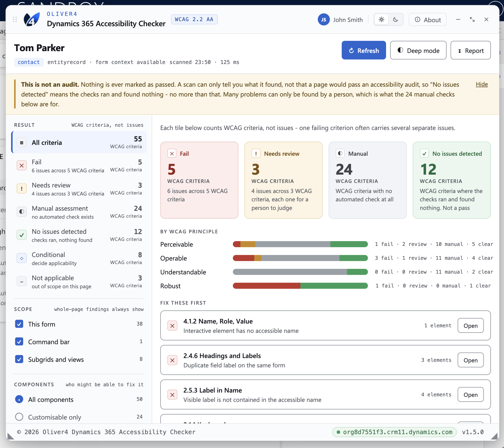
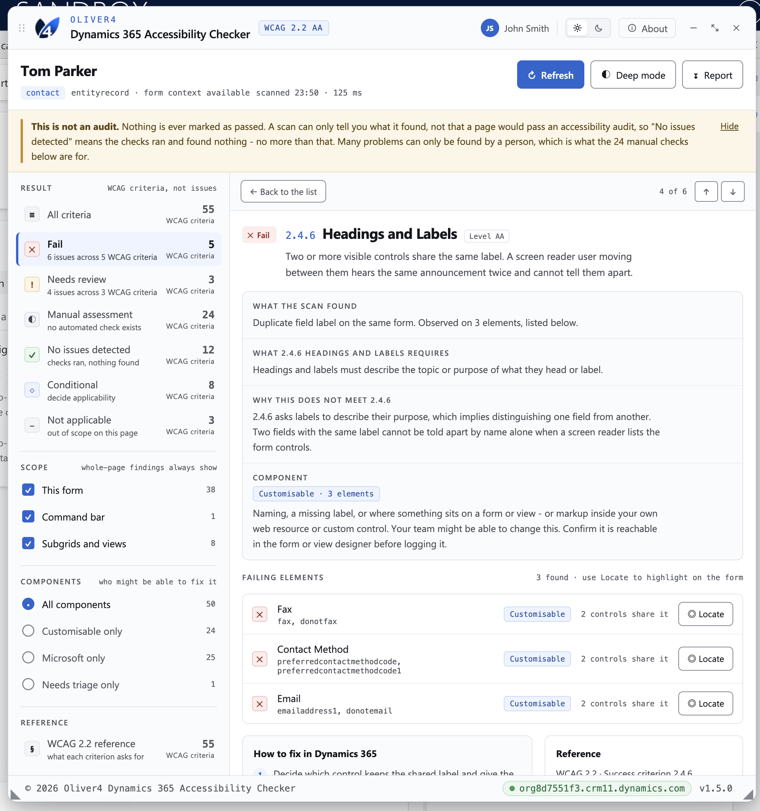
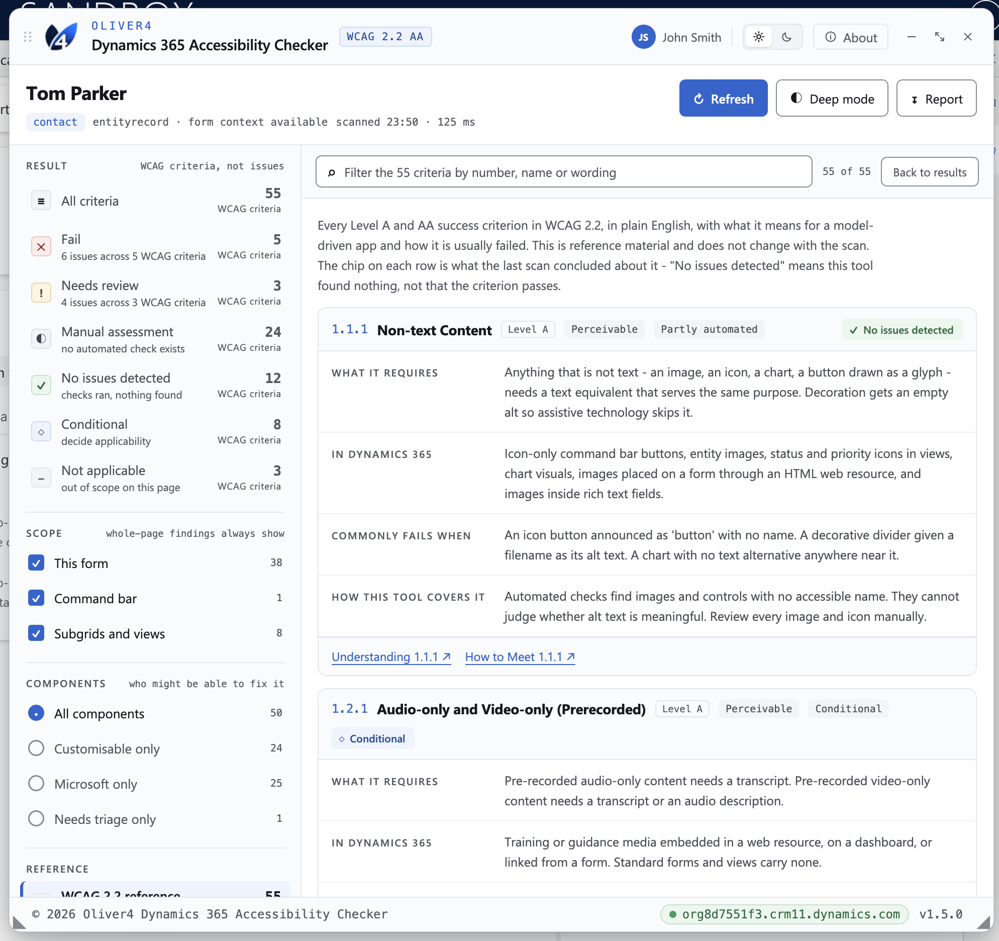

# Oliver4 D365 Accessibility Checker 

http://www.oliver4-devtools.com/

Version 1.5.0. Chrome and Edge, loaded unpacked. Not published to any store.

A developer aid for spotting likely WCAG 2.2 A/AA issues on Dynamics 365 model-driven forms
and views, run on demand from a toolbar button. It is not an accessibility audit and it is not
evidence of conformance. No criterion is ever reported as passing.

## Screenshots

**Overview.** The panel after a scan, with WCAG criteria grouped as Fail, Needs review, Manual
assessment and No issues detected, a breakdown by the four WCAG principles, and a "Fix these
first" list of the highest-priority failures.



**Issue detail.** Drilling into a single failing criterion - what the scan found, why it fails
the criterion, which elements failed with a Locate button to jump to each one on the form, and
how to fix it in Dynamics 365.



**WCAG reference.** All 55 Level A and AA success criteria in plain English, independent of any
scan - what each one requires, what it looks like in Dynamics 365, how it commonly fails, and
how far this tool's automated checks can cover it.



## What is in this folder

| Path | What it is |
|---|---|
| `extension/manifest.json` | Manifest V3. Carries the version number, the permissions and the icons |
| `extension/background.js` | Service worker. Runs the checker in the page when the toolbar button is clicked |
| `extension/lib/d365-accessibility-checker.js` | The checker itself, v1.5.0 |
| `extension/icons/` | The Oliver4 mark at 16, 32, 48 and 128 pixels, in a navy set and a white set |
| `README.md` | This file |

`extension/` is the folder to select when loading it. Nothing outside it is used at runtime.

## Install in Chrome

1. Go to `chrome://extensions`.
2. Turn on **Developer mode**, top right.
3. Click **Load unpacked** and select the `extension` folder, the one containing
   `manifest.json`.
4. Click the puzzle-piece **Extensions** button in the toolbar, then the pin next to
   **Oliver4 Dynamics 365 Accessibility Checker**, so the mark sits on the toolbar.

## Install in Edge

1. Go to `edge://extensions`.
2. Turn on **Developer mode**, bottom left.
3. Click **Load unpacked** and select the `extension` folder.
4. Pin it from the **Extensions** button in the toolbar.

Edge calls this sideloading and documents it at
[Sideload an extension to install and test it locally](https://learn.microsoft.com/en-us/microsoft-edge/extensions/getting-started/extension-sideloading).

### If Load unpacked is missing or greyed out

The browser is managed and developer mode is switched off by policy. Edge does this through
[ExtensionDeveloperModeSettings](https://learn.microsoft.com/en-us/deployedge/microsoft-edge-browser-policies/extensiondevelopermodesettings)
and Chrome through the policy of the
[same name](https://chromeenterprise.google/policies/extension-developer-mode-settings/).
On a locked-down government build this is likely, and there is no way round it from inside the
browser. Ask for the policy to be relaxed on the testing devices, or use a browser profile that
is not managed.

## Use it

1. Open a Dynamics 365 form or view in a normal tab.
2. Wait for the form to finish loading, including subgrids.
3. Click the Oliver4 mark in the toolbar. The panel opens on the right.
4. Click it again to close. `Escape` also closes it when focus is in the panel.

Leave the panel open while you work. Browse to another record or view, then press **Refresh**
in the panel to scan that page.

If the page is not a Dynamics 365 page, the panel opens read only, says so, and runs no scan.
The same thing happens if the app has not finished rendering when you click. Wait, then press
**Refresh**.

Two lines appear in the browser console when it opens:

```
[Oliver4 Dynamics 365 Accessibility Checker] v1.5.0 loaded from unknown source
[Oliver4 Dynamics 365 Accessibility Checker] injected by the browser extension, v1.5.0.
```

The first line comes from the checker itself and says "unknown source" because there is no
script element to read a URL from when the browser injects a file directly. That is expected
here and is not a defect. The second line is the extension confirming how the checker was
loaded.

### When something goes wrong

There is no `alert()` in an extension service worker, so failures show as a red `!` badge on
the toolbar button. Hover the button to read what happened. The message also goes to the
service worker console, reachable from the extension's card on the extensions page.

The badge clears on the next click and when the tab navigates.

Expected refusals - clicking the button on a browser tab, or before the page has finished
loading - are logged with `console.info`. Chrome collects anything a service worker logs with
`console.error` onto the **Errors** page on the extension's card, and an expected refusal
sitting there reads as a defect. Only a genuinely unexpected failure, caught by the catch-all
on the click handler, is logged as an error, so anything that does appear on that Errors page
is worth looking at.

## Permissions, and what it does not do

`manifest.json` requests two permissions and no host permissions:

- **`activeTab`** - access to the current tab, granted only when the toolbar button is clicked,
  and only until that tab navigates. This is why installing shows no "read your data on all
  websites" warning. See
  [The activeTab permission](https://developer.chrome.com/docs/extensions/develop/concepts/activeTab).
- **`scripting`** - needed to run the checker in the page.

The checker is injected into the **main world**, the page's own JavaScript context, because it
reads `window.Xrm`. A content script in the default isolated world cannot see the page's
objects, so the Xrm Client API would always look missing and only DOM checks would run. See
[Content scripts](https://developer.chrome.com/docs/extensions/develop/concepts/content-scripts)
and the `world` property on
[chrome.scripting](https://developer.chrome.com/docs/extensions/reference/api/scripting),
available from Chrome 95.

Everything the checker does happens in the browser. No network calls of any kind. The
extension has no host permissions, no `tabs` permission, no storage of its own, no remote code,
and no content script that runs on page load. It does nothing at all until the toolbar button is
clicked.

`localStorage` on the org origin holds the light or dark theme choice for the panel.

It still injects JavaScript into an authenticated session, so:

- Get it through security review before anyone runs it against Production.
- Prefer Dev and Test.
- An unpacked extension is not signed and does not auto-update. Everyone running it holds their
  own copy of the folder, and there is no mechanism to push a fix to them. Track the folder in
  source control and tell testers when to pull a new version.

## Updating to a new build of the checker

1. Drop the new `d365-accessibility-checker.js` into `extension/lib/`, replacing the old one.
2. Set `version` in `extension/manifest.json` to the new version.
3. Update the `Version` line in the banner at the top of `extension/background.js`.
4. Update the matching version references inside `d365-accessibility-checker.js` itself (the
   `VERSION` constant and the banner comment at the top of the file).
5. Go to `chrome://extensions` or `edge://extensions` and press **Reload** on the extension's
   card. Reload any open D365 tab.

Keep all of these in step or the console line and the extension will disagree about which
build is running.

If the checker's host element ID ever changes, `HOST_ID` in `background.js` has to change with
it. That constant is how the extension knows whether a click opened the panel or closed it.
